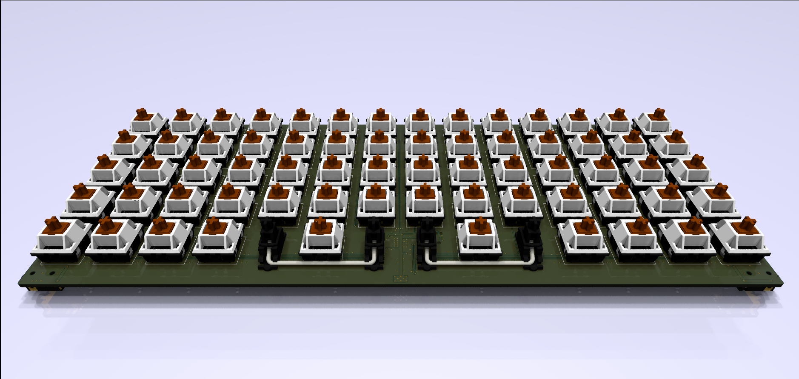
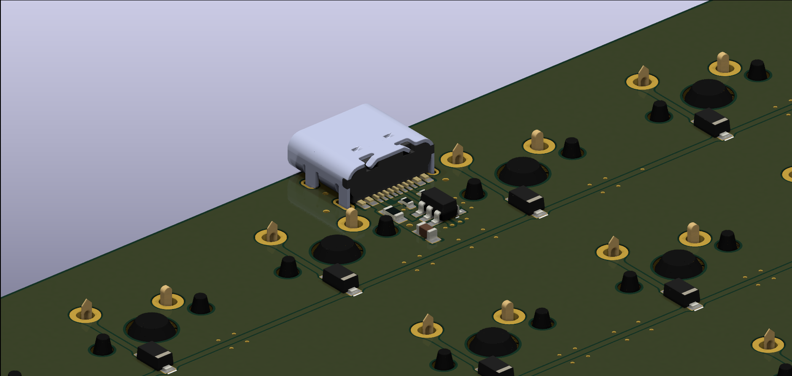
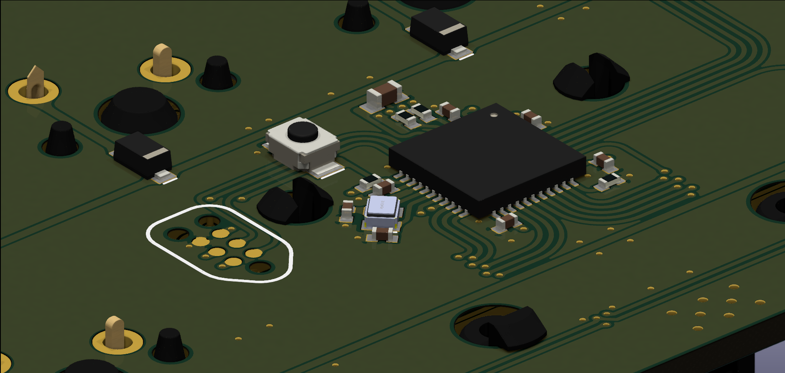
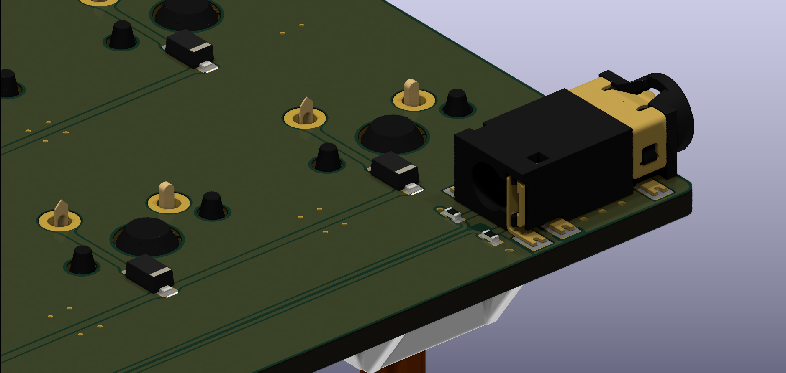

# un**ORTHO**dox

Devices

* UNO-XXX are main hosts, direct USB HID devices
* DOX-XXX are I2C expansion modules, connected via TRRS to the I2C bus and 5V power rails

## **UNO-W14** : 14x5 ortholinear keyboard

## **DOX**-XXX : I2C expansion modules

[TODO] ... space for future development
